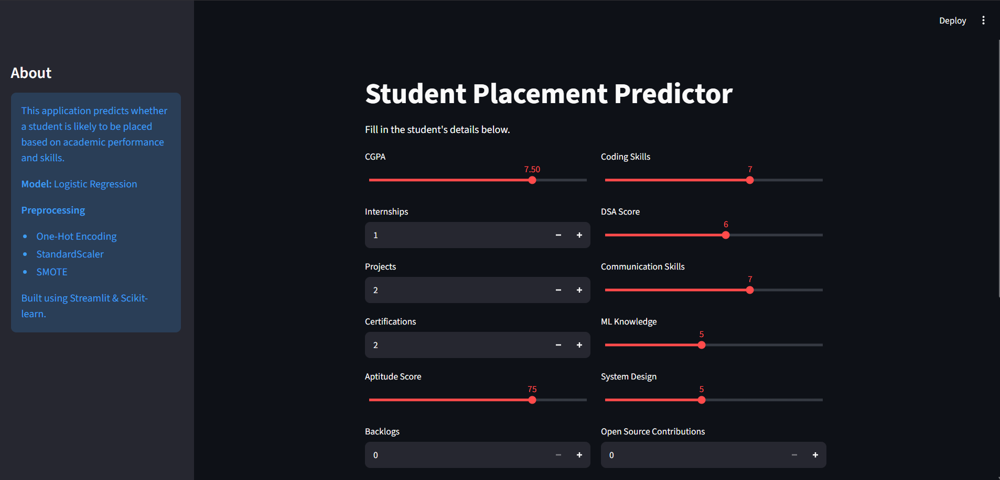

## Student Placement Prediction System

An end-to-end Machine Learning project that predicts whether a student will get placed during campus recruitment. Built with Python, Scikit-learn, and Streamlit.

## What it does
Build a robust ML model to predict student placement (Yes/No) based on academic performance, technical skills, internships, and extracurriculars. Includes EDA, interactive dashboard, and a live web app.

**Key Points**:
- Achieved **66.65% accuracy** and 66.44 F1 and Recall score using Random Forest / Gradient Boost
- CGPA and Internships are top predictors
- Interactive Streamlit web app with Job Role Suggestion

## Dataset i used
- **Source**: [Student Placement Prediction Dataset by Suhani Gupta (Kaggle)](https://www.kaggle.com/datasets/suhanigupta04/student-placement-prediction-dataset)
- **Size**: 100,000 records
- **Key Features**: CGPA, Internships, Projects, Coding/DSA Skills, Aptitude Score, College Tier, Branch, etc.
- **Target**: `placement_status` (0 = Not Placed, 1 = Placed)

## Tech Stuff Used
- **Programming**: Python / Jupyter notebook
- **Data Analysis**: Pandas, NumPy, Matplotlib, Seaborn
- **Machine Learning**: Scikit-learn, Gradient boost
- **Visualization**: Matplotlib
- **Deployment**: Streamlit Cloud

## Good things about Project!
- Comprehensive Exploratory Data Analysis (EDA)
- Data Preprocessing & Feature Engineering
- Multiple ML Models with Hyperparameter Tuning
- Live Web Predictor (Streamlit)

# Key Insights
- CGPA is the strongest predictor of placement success.
- Students with 2+ internships have significantly higher placement rates.
- Tier-1 college students show better outcomes.
- Technical skills (Coding, DSA) play a crucial role alongside academics.

## Model Performance
| Model                | Accuracy | ROC-AUC |
|----------------------|----------|---------|
| Gradient Boosting    | 66.65%   | 67.14   |
| Random Forest        | 67.09%   | 66.48   |
| Logistic Regression  | 65.32%   | 65.49   |

**Best Model**: Gradient Boosting (67% accuracy)

## LIVE Demo ON STREAMLIT CLOUD
- **Live App**: 
Link - (https://ml-prediction-garvil.streamlit.app)

